# 🚀 gochat
[](https://github.com/LockGit/gochat/issues)


### [English version(英文版本)](readme.en.md)

### gochat是一个使用纯go实现的轻量级im系统
* gochat为纯go实现的即时通讯系统,支持私信消息与房间广播消息,各层之间通过rpc通讯,支持水平扩展。
* 支持websocket,tcp接入,并且在最新的版本中已经支持websocket,tcp消息互通。
* 各层之间基于etcd服务发现,在扩容部署时将会方便很多。
* 使用redis作为消息存储与投递的载体,十分轻量,在实际场景中还可以替换为更重的类似kafka,rabbitMQ。
* 由于go的交叉编译特性,编译后可以快速在各个平台上运行,gochat架构及目录结构清晰。
* 本项目贴心的提供了docker一键构建所有环境依赖,安装起来十分便捷。(如果是体验，强烈建议使用docker构建)

### 更新
* 2022年08月06日
  * 虽然UI在本系统中并不是很重要，但看着确实别扭，用TypeScript+React糊了一个稍微看上去正常一些的前端UI界面，UI项目地址：https://github.com/LockGit/gochat-ui
* 2022年05月08日
  * 目前golang版本升级到了1.18，如果未使用docker，选择自己编译安装请确保自己的go版本是否符合要求
  * vendor也打包到了仓库里，加上vendor整个项目大小约66M，理论git clone后就就可以使用，由于不可抗拒的网络因素，可能需要较长时间
  * 升级了一些包依赖版本，不建议在低版本的golang上尝试编译本项目，尽量升级到1.18+
  * 优化：watch etcd的中对应的kv变化，动态更新服务ip地址，确保新增/移除各层后其他层能够感知

### Websocket && Tcp消息互通
```
关于最新版本支持支持websocket,tcp消息互通部分的说明：
tcp消息投递与接收测试代码在本项目pkg/stickpackage目录中的:stickpackage_test.go文件中的Test_TcpClient方法
其中stickpackage.go文件主要为实现tcp拆包解包时用到，可以追踪下其中Pack与Unpack方法的调用地方。
主要原因是tcp是基于第4层的流式协议而非应用层协议，所以才有了这个过程。
如果是android，ios客户端来链接，那么对应的就是需要用熟悉的语言来实现这个tcp拆包解包的过程，例子中的代码是golang实现的demo。
go test -v -count=1 *.go -test.run Test_TcpClient

如果是测试tcp消息投递:
只需要修改这个方法中@todo部分的内容为你测试时正确的内容即可,测试tcp端口使用7001，7002，如果是在个人vps上,注意配置防火墙放行相关端口。
authToken为进行tcp链接时的认证token，这个token是用户标识，在web上登录后的api返回中可以看到json返回，也可以直接在redis中去查到某一个用户的token。
服务端接收到这个authToken时会把对应用户tcp链接会话加入到相应房间的会话双向链表中。

加入支持tcp后,如果一个房间中既有通过websocket进行链接的用户，又有通过tcp进行链接的用户，那么消息投递大致流程：
1，首先用户登录，携带token，房间号去连接websocket,tcp服务端，在链接层建立长链接会话，
比如用户A在房间1，通过websocket链接，用户B也在房间1，通过tcp链接。

2，用户向房间内发送消息，目前是直接把消息通过http投到相应消息队列中，
这个地方，其实也可以通过websocket,tcp来发，不过最终消息都是要进队列的。

3，task层消费队列中的消息，rpc广播到websocket链接层和tcp链接层的相应房间中，
链接层获得消息后，把消息投递到对应的远端用户(相当于遍历房间中维护的用户链接会话双向链表)
```
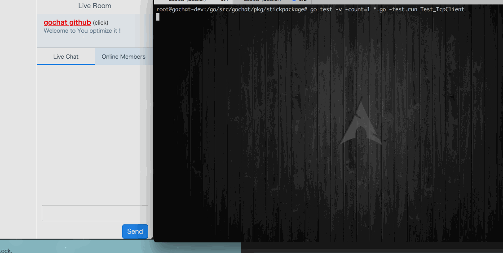


### 架构设计
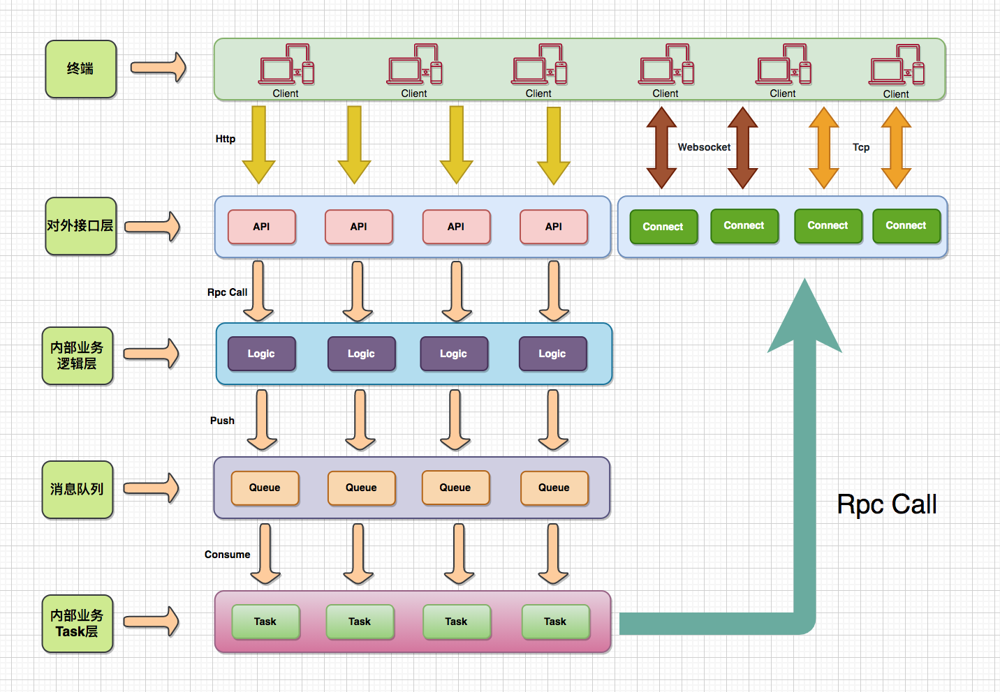

### 服务发现
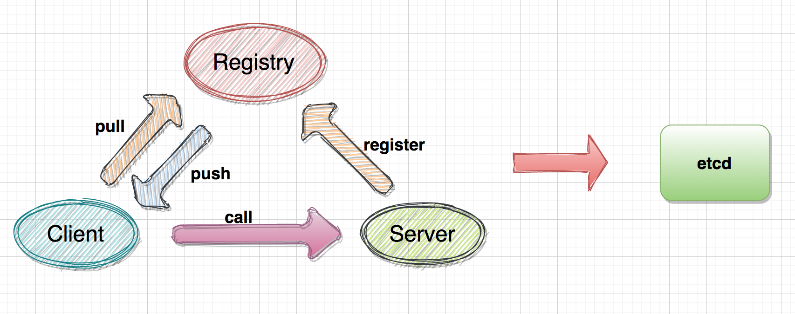


### 消息投递
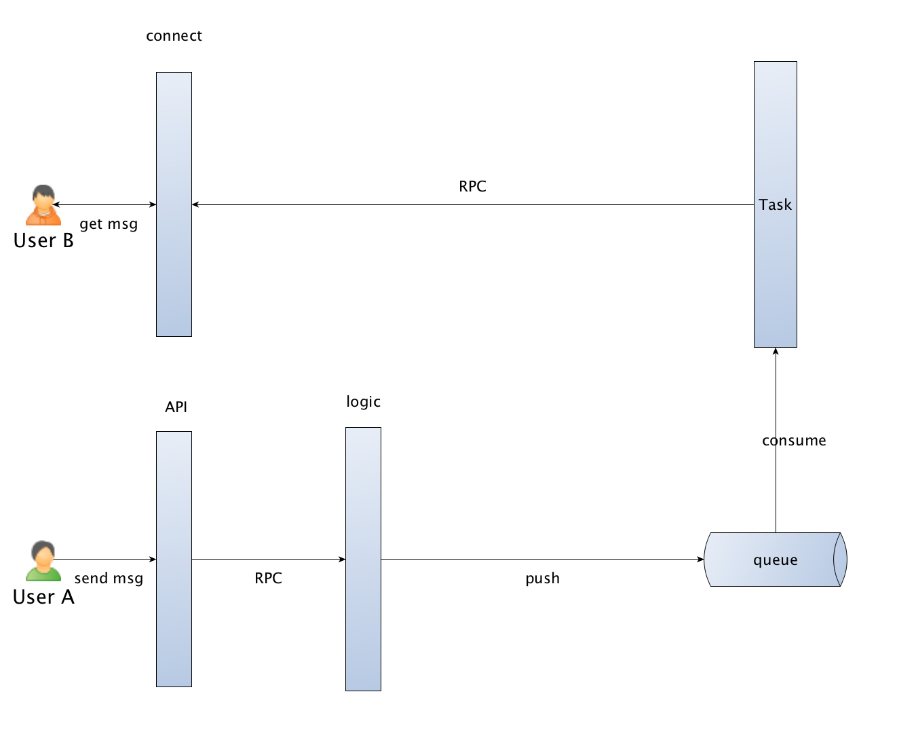
```
消息发送必须在登录状态下,如上图,用户A向用户B发送了一条消息。那么经历了如下历程：
1,用户A调用api层接口登录系统,登录成功后与connect层认证保持长链接,
并rpc call logic层记录用户A在connect层登录的serverId,默认加入房间号1

2,用户B调用api层接口登录系统,登录成功后与connect层认证保持长链接,
并rpc call logic层记录用户B在connect层登录的serverId,默认加入房间号1

3,用户A调用api层接口发送消息,api层rpc call logic层发送消息方法,
logic层将该消息push到队列中等待task层消费

4,task层订阅logic层发送到队列中的消息后,
根据消息内容(userId,roomId,serverId)可以定位用户B目前在connect层那一个serverId上保持长链接,
进一步rpc call connect层方法

5,connect层被task层rpc call之后,会将该消息投递到相关房间内，
再进一步投递给在该房间内的用户B,完成一次完整的消息会话通讯

6,如果是私信消息,那么task层会根据userId定位connect层对应的serverId,
直接rpc call 该serverId的connect层，完成私信消息投递。

学习其他im系统，为了减少锁的竞争,会在connect层会划分bucket:
大致会像如下结构：
connect层:
    bucket: (bucket,减少锁竞争)
        room: (房间)
            channel: (用户会话)
```

### 时序图
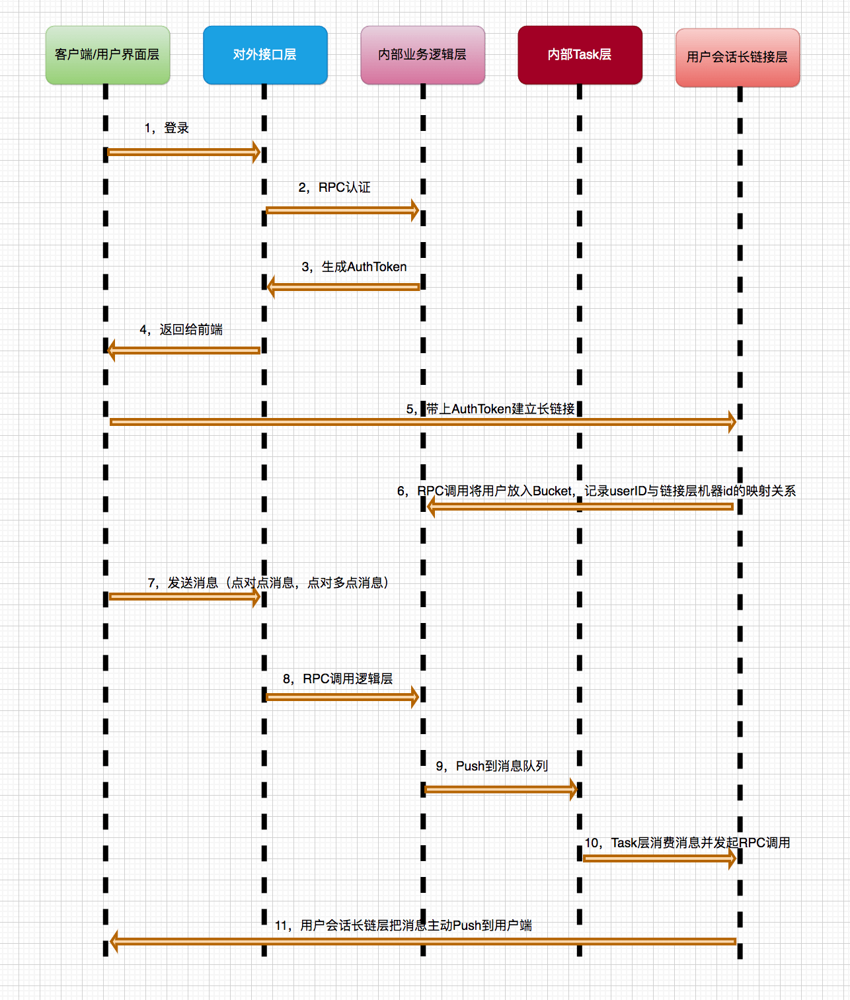

### 聊天室预览
用TypeScript + React 糊了一个稍微看上去正常一些的前端UI，UI项目地址：https://github.com/LockGit/gochat-ui
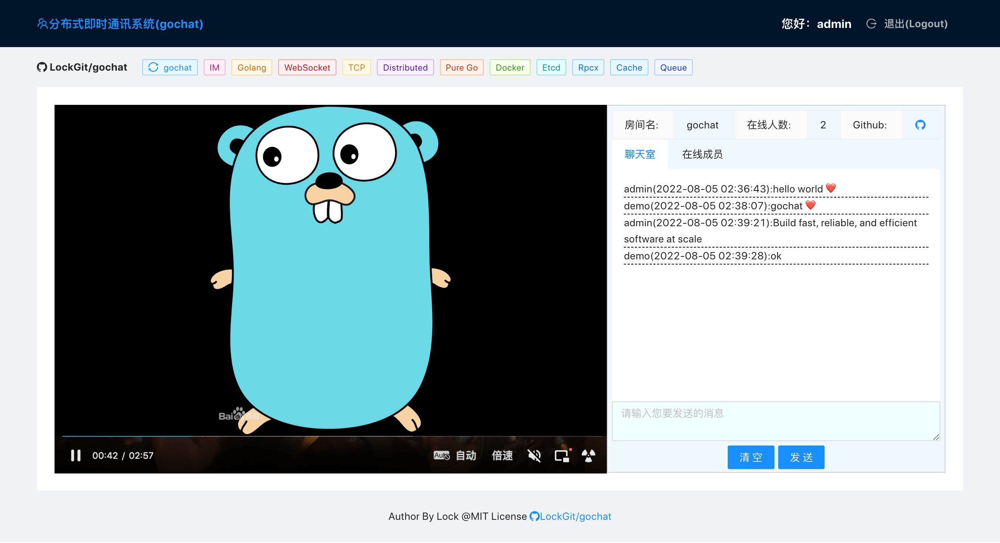

### 用户长链接会话内部结构
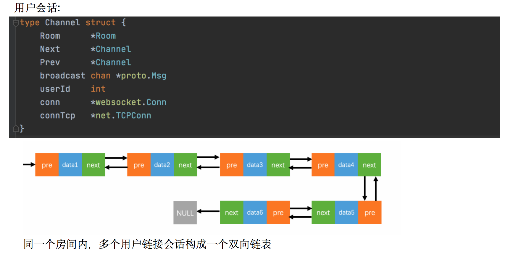

### 划分bucket减小锁竞争
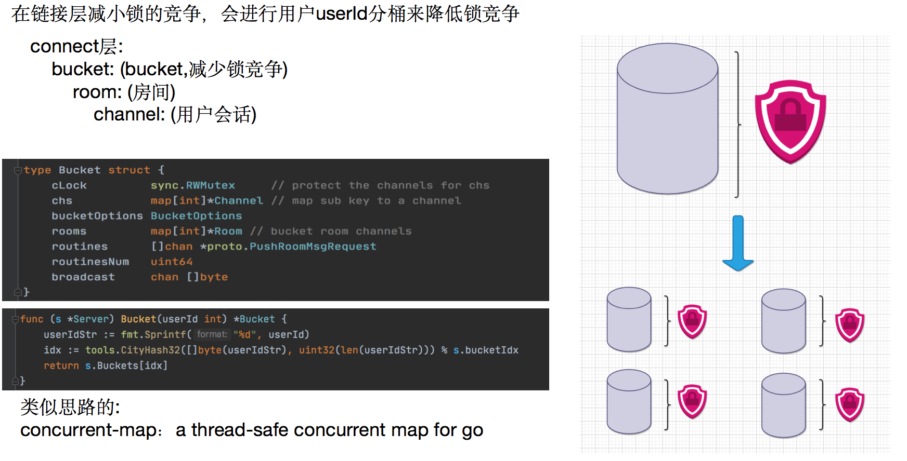

### 基于CityHash让hash分布的更均匀
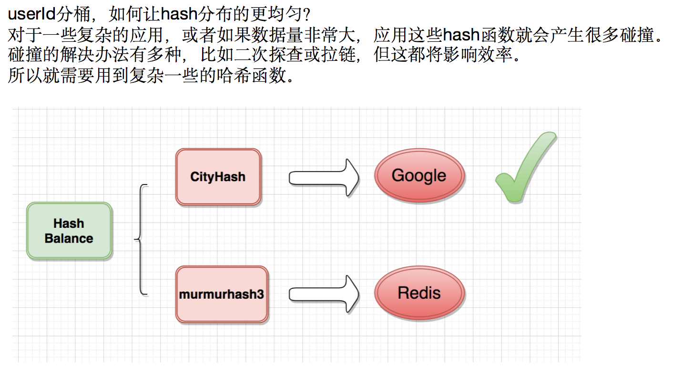

### 链接层的单个server内部结构预览
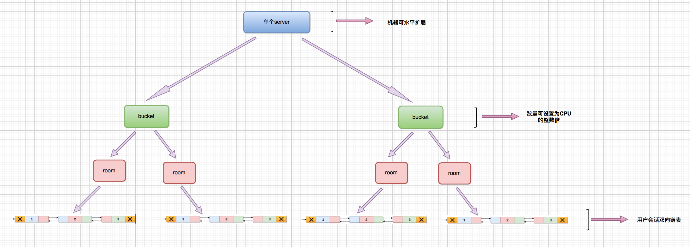

### 简单压测
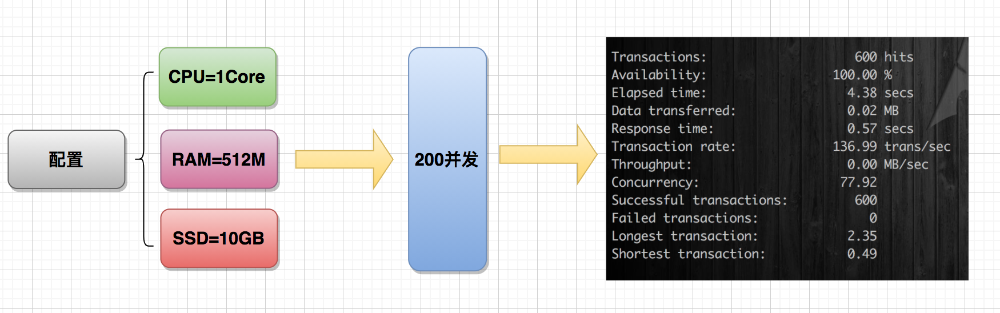

### 目录结构
```
➜  gochat git:(master) ✗ tree -L 1
.
├── api                  # api接口层,提供rest api服务,主要rpc call logic层服务,可水平扩展 
├── architecture         # 架构图资源图片文件夹
├── bin                  # golang编译后的二进制文件,不参与提交至git仓库
├── config               # 配置文件
├── connect              # 链接层,该层用于handler住大量用户长连接,实时消息推送,除此之外,主要rpc call logic层服务,可水平扩展
├── db                   # 数据库链接初始化,内部gochat.sqlite3为方便演示时使用的sqlite数据库,实际场景可替换为其他关系型数据库
├── docker               # 用于快速构建docker环境
├── go.mod               # go包管理mod文件
├── go.sum               # go包管理sum文件
├── logic                # 逻辑层,该层主要接收connect层与api层的rpc请求。如果是消息,会push到队列,最终被task层消费,可水平扩展
├── main.go              # gochat程序唯一入口文件
├── proto                # golang rpc proto 文件
├── readme.md            # 中文说明文档
├── readme.en.md         # 英文说明文档
├── reload.sh            # 编译gochat并执行supervisorctl restart重启相关进程
├── run.sh               # 快速构建一个docker容器,启动demo
├── site                 # 站点层,该层为纯静态页面,会http请求api层,可水平扩展
├── task                 # 任务层,该层消费队列中的数据,并且rpc call connect层执行消息的发送,可水平扩展
├── tools                # 工具方法
└── vendor               # vendor包
```

### 相关组件
```
语言：golang

数据库：sqlite3 
可以根据实际业务场景替换成mysql或者其他数据库,
在本项目中为方便演示,使用sqlite替代大型关系型数据库,仅存储了简单用户信息

数据库ORM：gorm 

服务发现：etcd

rpc通讯：rpcx

队列:redis 
方便演示使用redis,可以根据实际情况替换为kafka或者rabbitmq

缓存:redis 
存储用户session,以及相关计数器,聊天室房间信息等

消息id:
snowflakeId算法,此部分可以单独拆分成微服务,使其成为基础服务的一部分。
该id发号器qps理论最高409.6w/s,互联网上没有哪一家公司可以达到这么高的并发,除非遭受DDOS攻击
```

### 数据库及表结构
```
在本demo中,为了足够轻量方便演示,数据库使用了sqlite3,基于gorm,所以这个是可以替换的。
如果需要替换其他关系型数据库,仅仅只需要修改相关db驱动即可。

相关表结构：
cd db && sqlite3 gochat.sqlite3
.tables
```
```sqlite
create table user(
                   `id` INTEGER PRIMARY KEY autoincrement , -- '用户id'
                   `user_name` varchar(20) not null UNIQUE default '', -- '用户名'
                   `password` char(40) not null default '', -- '密码'
                   `create_time` timestamp NOT NULL DEFAULT current_timestamp -- '创建时间'
);
```

### 安装
```
在启动各层之前,请确保已经启动了etcd与redis服务以及以上数据库表,
并确保【7000, 7070, 8080】端口没有被占用。（测试tcp端口使用7001，7002，如果要使用tcp,那么防火墙也需要放行这两个端口）
然后按照以下顺序启动各层,如果要扩容connect层,
请确保connect层配置中各个serverId不一样!

0,编译
go build -o gochat.bin -tags=etcd main.go

1,启动logic层
./gochat.bin -module logic

2,启动connect层
./gochat.bin -module connect_tcp
或者  
./gochat.bin -module connect_websocket

3,启动task层
./gochat.bin -module task

4,启动api层
./gochat.bin -module api 

5,启动一个站点,开始聊天室
./gochat.bin -module site
```

### 使用docker一键启动

#### 使用现有镜像
amd x86架构
```
如果你觉得以上步骤过于繁琐,你可以使用以下docker镜像构建所有依赖环境并快速启动一个聊天室
执行docker相关步骤的时候,会到hub.docker.com拉取相关镜像,可能需要翻墙,具体看你的网络。

你可以使用我推到docker hub上的镜像:
默认镜像中已经创建了几个测试用户：
用户名,密码
demo  111111
test  111111
admin 111111
1,docker pull lockgit/gochat:1.18 (目前使用的是1.18版本)
2,git clone git@github.com:LockGit/gochat.git
3,cd gochat && sh run.sh dev 127.0.0.1 (该步骤需要一定时间编译各个模块，耐心等待即可,部分系统可能没有sh,如果执行报错,把sh run.sh dev改为./run.sh dev 127.0.0.1执行）
4,访问 http://127.0.0.1:8080/login 输入用户名/密码以访问聊天室
5,访问 http://127.0.0.1:8080 开启聊天室
```

#### 构建新镜像
```
如果你想自己构建一个镜像,那么只需要build docker文件下的Dockerfile
make build TAG=1.18(这里的1.18就是run.sh中的镜像用到的版本）
上面build过程可能需要翻墙且需要一定时间，完成后执行:
1,git clone git@github.com:LockGit/gochat.git
2,cd gochat && sh run.sh dev 127.0.0.1 (该步骤需要一定时间编译各个模块，耐心等待即可,部分系统可能没有sh,如果执行报错,把sh run.sh dev改为./run.sh dev 127.0.0.1执行）
3,访问 http://127.0.0.1:8080/login 输入用户名/密码以访问聊天室
4,访问 http://127.0.0.1:8080 开启聊天室

如果你要部署在个人vps等公网上，让别人也能访问使用，执行 （sh run.sh dev 需要暴露的公网ip地址）即可
并确保vps上没有针对相关端口的防火墙限制。
```

### 这里提供一个在线聊天demo站点：
<a href="http://45.77.108.245:8080" target="_blank">http://45.77.108.245:8080</a>
```
用以上用户名密码登录即可,也可以自己注册一个。如果无法访问了，请使用以上docker在本地构建体验。
可用不同的账号在不同的浏览器登录,如果是Chrome,可用以隐身模式多启动几个浏览器分别以不同账号登录,
然后,体验不同账号之间聊天以及消息投递效果。(注:本demo未开启tcp的通道)
```
如果想部署类似的私人im聊天服务到公网体验，也可在vultr上注册账号购买一个vps主机，部署im服务体验：
<a href="https://www.vultr.com/?ref=8981750-8H" target="_blank">https://www.vultr.com/?ref=8981750-8H</a>


### 相关问题解答
```
整理出了几个讨论比较多的问题:
1，在发送消息的时候是通过http,为什么不是websocket?
这是server demo im,完全可以通过websocket来发送，效果一样，把相关逻辑处理放到websocket里即可，目前的消息通过http发送后也是rpc call后面的链接层进入队列

2，消息是否存储数据库?
没有存储，消息目前仅仅是在队列里流了一遍后投递出去，可以自己加存储逻辑
```

### 后续
```
gochat实现了简单聊天室功能,由于精力有限,你可以在此基础上使用自己的业务逻辑定制一些需求,并优掉一些gochat中的代码。
使用中的任何问题请提相关issue,后续会根据实际情况完善和优化相关代码与设计。
```

### Backer and Sponsor
>jetbrains

<a href="https://www.jetbrains.com/?from=LockGit/gochat" target="_blank">

</a>

```
jetbrains有一项开源赞助计划，可以通过开源项目免费申请jetbrains全家桶license
jetbranins官方在赠送license的时候会请求提议加入他们的品牌logo推广放入到仓库中,
不过这一切都是用户自愿的原则
```

### Support gochat
```
您的支持也是一种肯定，如果您觉得有帮助也可以通过扫描下面的微信二维码支持作者继续优化和完善gochat
```
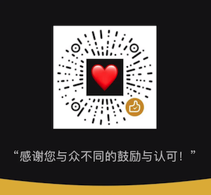

### License
gochat is licensed under the MIT License. 


